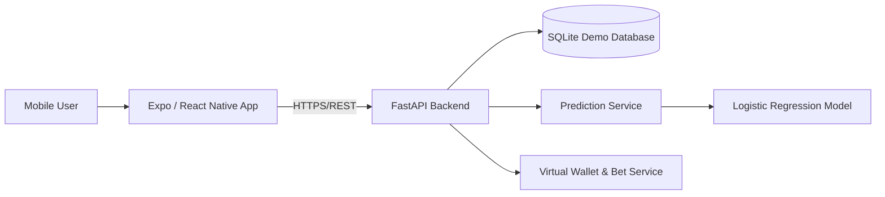

# SportsAI Sim

**SportsAI Sim** is a portfolio-ready mobile application that demonstrates AI-assisted sports prediction, mobile development, REST API design, persistence, authentication, and end-to-end testing.

> **Important:** This project uses **virtual credits only**. It does not process real money, connect to sportsbooks, or provide gambling advice. The included sports data is fictional/demo data.

## Why this project exists

The project is designed to show employers a complete systems-development workflow rather than only a UI mockup. It includes requirements, architecture, interfaces, database persistence, an ML-based prediction service, mobile integration, security-conscious authentication, and automated API tests.

## Architecture



## Features

- Mobile game list and matchup selection
- Demo account registration/login
- AI-assisted home/away win probabilities
- Plain-language prediction explanations
- Virtual wallet initialized with 1,000 credits
- Simulated bet placement and bet history API
- SQLite persistence
- Password hashing with PBKDF2-HMAC-SHA256
- Bearer-token authentication
- FastAPI OpenAPI/Swagger documentation
- Automated API test covering registration, games, prediction, wallet debit, and bet history
- Dockerfile for backend deployment

## Technology

- **Mobile:** React Native with Expo
- **Backend:** Python + FastAPI
- **Database:** SQLite
- **AI/ML:** scikit-learn Logistic Regression
- **Testing:** pytest + FastAPI TestClient
- **Deployment-ready backend:** Docker

## Repository structure

```text
ai-sports-predictor/
├── backend/
│   ├── app/
│   │   └── main.py
│   ├── tests/
│   │   └── test_api.py
│   ├── Dockerfile
│   └── requirements.txt
├── mobile/
│   ├── App.js
│   ├── app.json
│   ├── package.json
│   └── .env.example
├── docs/
│   ├── ARCHITECTURE.md
│   ├── REQUIREMENTS.md
│   ├── TEST_PLAN.md
│   └── PORTFOLIO_NOTES.md
├── .gitignore
├── LICENSE
└── README.md
```

## Run the backend

```bash
cd backend
python -m venv .venv
# macOS/Linux
source .venv/bin/activate
# Windows PowerShell
# .venv\Scripts\Activate.ps1
pip install -r requirements.txt
uvicorn app.main:app --reload
```

Then open the API documentation at `http://127.0.0.1:8000/docs`.

## Run the mobile app

In another terminal:

```bash
cd mobile
npm install
cp .env.example .env
npm start
```

If you use a physical phone, change `EXPO_PUBLIC_API_URL` in `.env` from `127.0.0.1` to the LAN IP address of the computer running the backend.

## Run automated tests

```bash
cd backend
pytest -q
```

## Demo workflow

1. Start the FastAPI backend.
2. Start the Expo app.
3. Tap **Demo Sign In**. The app creates or logs into a demo portfolio account.
4. Select a matchup.
5. Review the model-generated probabilities and explanation.
6. Enter a virtual stake and place a simulated home or away bet.
7. The virtual wallet is debited and the simulated bet is persisted.

## How the AI component works

The demo prediction service trains a reproducible Logistic Regression model when the API starts. The generated training sample represents three normalized signals: relative team rating, relative recent form, and injury/availability advantage. Each matchup is converted into those features and passed to `predict_proba()` to produce home/away probability estimates.

This is deliberately a transparent portfolio model—not a claim of real-world predictive accuracy. A production implementation would use licensed historical sports data, rigorous feature engineering, time-aware validation, calibration, drift monitoring, and documented model-governance controls.

## Security notes

This project demonstrates several baseline controls: passwords are never stored in plain text, tokens are randomly generated, protected endpoints require bearer authentication, input is validated with Pydantic, and SQL values are parameterized. For production, use a managed identity provider, HTTPS, secure token storage/rotation, rate limiting, secrets management, a production database, least-privilege authorization, audit logging, and formal threat modeling.

## Portfolio talking points

This project can be discussed in interviews as an example of:

- translating a product concept into testable requirements;
- designing a mobile-to-backend system boundary and REST interfaces;
- integrating an ML component without coupling it to the UI;
- implementing authentication, persistence, and input validation;
- validating the end-to-end workflow with automated tests;
- separating a safe virtual-credit simulation from real-money wagering infrastructure.

## Future enhancements

- Replace fictional fixtures with a licensed sports-data API
- Add refresh-token authentication and role-based access control
- Move persistence to PostgreSQL
- Add model calibration and backtesting dashboards
- Add explainability metrics and model version tracking
- Add push notifications and favorite teams
- Add CI/CD with GitHub Actions
- Deploy backend to a cloud platform and mobile builds with EAS

## License

MIT License. See [LICENSE](LICENSE).
